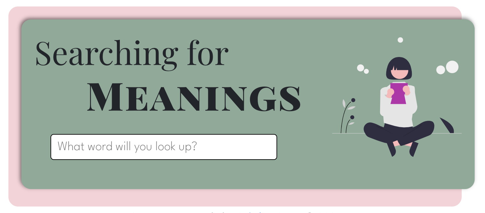

<!-- PROJECT LOGO 
[![React][contributors-shield]][contributors-url]
[![Bootstrap][forks-shield]][forks-url]
[![axios][stars-shield]][stars-url]
[linkedin-shield]: https://img.shields.io/badge/-LinkedIn-black.svg?style=for-the-badge&logo=linkedin&colorB=555 -->

<!-- PROJECT LOGO -->
<br />
<div align="center">
    
  </a>

  <h2 align="center">Searching for Meanings</h2>

  <p align="center">
    <a href="https://sgortz-dictionary.netlify.app/">View Demo</a>
    ·
    <a href="https://github.com/sgortz/dictionary-project-react/issues">Report Bug</a>
  </p>
</div>


## About this project


<!--PROJECT SCREENSHOT HERE-->

Simple dictionary app that shows definitions and synonyms of a word upon lookup. This project was created with the intent to learn more about React and conditional rendering.


## Getting Started

To download a copy of this project to your local machine: 

```sh
$ git clone https://github.com/sgortz/dictionary-app.git
```

Install dependencies and run the server

```sh
$ npm install
$ npm start
```

The page will reload automatically if you make edits.\
You will also see any lint errors in the console.

<!-- CONTACT -->
## Contact

[![LinkedIn][linkedin-shield]][linkedin-url]

<!-- ACKNOWLEDGMENTS -->
## Tech Stack

* [Create React App](https://create-react-app.dev/)
* [Bootstrap](https://www.webpagefx.com/tools/emoji-cheat-sheet)
* [Free Dictionary API](https://dictionaryapi.dev/)
* [Undraw Illustrations](https://undraw.co/illustrations)
* [axios](https://axios-http.com/)
* [Img Shields](https://shields.io)

[linkedin-shield]: https://img.shields.io/badge/-LinkedIn-black.svg?style=for-the-badge&logo=linkedin&colorB=555
[linkedin-url]: https://linkedin.com/in/sabrinagortz
